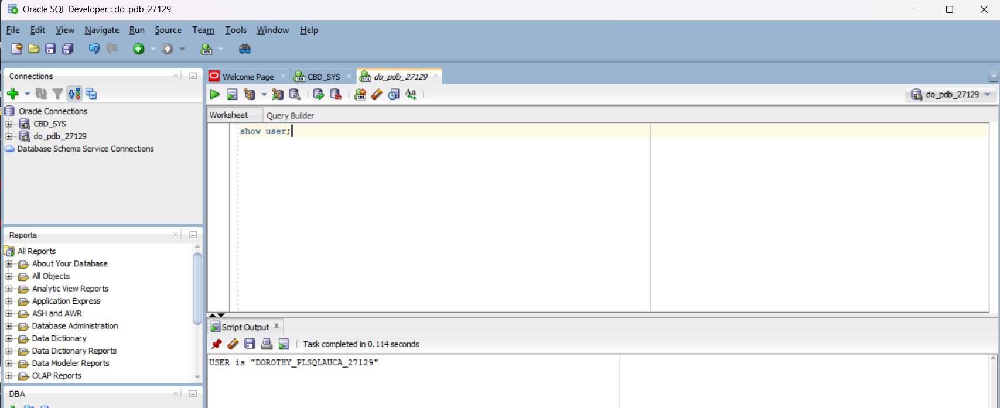
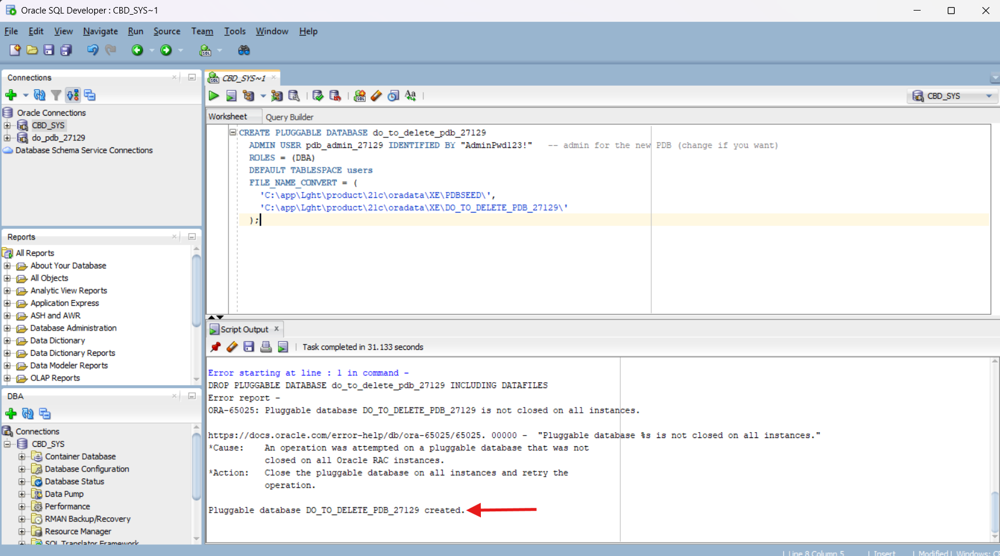
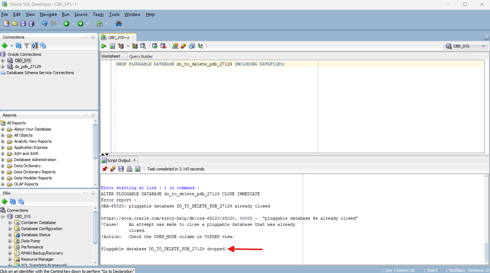
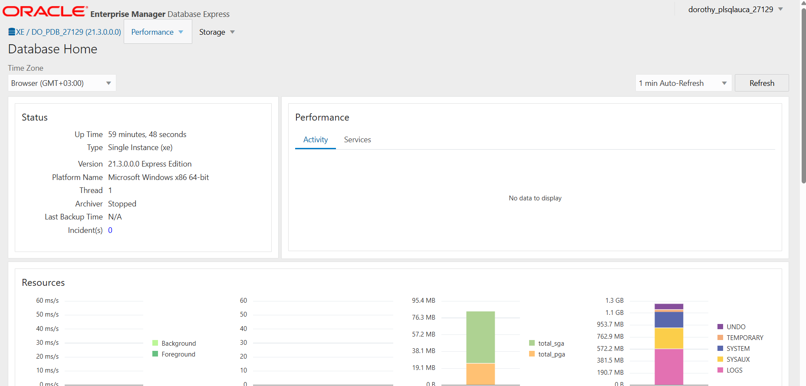

# Oracle PDB Practical Report

**Name:** Nshuti Dorothy  
**ID:** 27129  

---

## Overview of Tasks

### Task 1 – Create a New Pluggable Database (PDB)
- **PDB Name:** `do_pdb_27129`
- **Admin User:** `dorothy_plsqlauca_27129`
- **Purpose:** Store class work and demonstrate creation of a PDB.
- **Tools Used:** SQL Developer / SQL*Plus

**Description:**
I created a new pluggable database using SQL Developer. After setting the proper file paths and assigning an admin user, the PDB was successfully created. I verified the PDB status using `SELECT pdb_name, status FROM dba_pdbs;` and confirmed the user existed.

**Screenshot:**


---

### Task 2 – Create and Delete a PDB
- **PDB Name Created:** `do_to_delete_pdb_27129`
- **Admin User:** `dorothy_plsqlauca_27129` (Password: 123)

**Steps:**
1. Created the PDB successfully using SQL Developer and specified the proper FILE_NAME_CONVERT paths.
2. Opened the PDB to ensure it was active.
3. Closed the PDB immediately before deletion.
4. Dropped the PDB including all datafiles to fully remove it.

**Purpose:** Demonstrate creation and safe deletion of a PDB.

**Screenshot (Creation):**


**Screenshot (Deletion):**


---

### Task 3 – Oracle Enterprise Manager (OEM)
- **PDB Accessed:** `do_pdb_27129`
- **Username:** `dorothy_plsqlauca_27129`

**Purpose:** Show graphical proof of PDB and user created in Tasks 1 & 2.

**Notes:** Logged into OEM selecting the PDB container instead of the root container (CDB$ROOT) to display the correct username and PDB.

**Screenshot (OEM Dashboard):**


---

## Issues Encountered & Solutions

### ORA-65025: Pluggable database is not closed on all instances

**Problem:** While attempting to delete the PDB `do_to_delete_pdb_27129`, Oracle reported an error because the PDB was still open and active. The initial DROP command failed because the database needed to be closed first.

**Solution:** I executed `ALTER PLUGGABLE DATABASE do_to_delete_pdb_27129 CLOSE IMMEDIATE;` before running the DROP command. This properly closed the PDB and allowed for successful deletion with the `INCLUDING DATAFILES` option.

### PDB Already Closed Warning

**Problem:** After encountering the ORA-65025 error and attempting to close the PDB, I received a warning that the PDB was already closed in some instances.

**Solution:** I proceeded with the deletion process since the PDB was in the correct closed state. The warning didn't prevent the successful completion of the DROP operation.

### File Path Configuration for PDB Creation

**Problem:** During initial PDB creation, ensuring correct file path conversion from the PDB seed to the new PDB directory required careful path specification.

**Solution:** I verified the source PDB seed location and created appropriate target directories, then used the FILE_NAME_CONVERT parameter to map the paths correctly in the CREATE PLUGGABLE DATABASE command.

### OEM Container Selection

**Problem:** When logging into Oracle Enterprise Manager, selecting the correct container to display the specific PDB and its associated users required careful navigation.

**Solution:** I ensured I was connected to the specific PDB container (`do_pdb_27129`) rather than the root CDB to properly view and verify the PDB-specific information and admin user.

---

## Key SQL Commands Used

```sql
-- Create PDB
CREATE PLUGGABLE DATABASE do_pdb_27129 
ADMIN USER dorothy_plsqlauca_27129 IDENTIFIED BY 123;

-- Create temporary PDB for deletion demo
CREATE PLUGGABLE DATABASE do_to_delete_pdb_27129 
ADMIN USER dorothy_plsqlauca_27129 IDENTIFIED BY 123 
FILE_NAME_CONVERT = (
    'C:\app\Light\product\21c\oradata\XE\pdbseed\',
    'C:\app\Light\product\21c\oradata\XE\do_to_delete_pdb_27129\'
);

-- Verify PDB status
SELECT pdb_name, status FROM dba_pdbs;

-- Close PDB before deletion
ALTER PLUGGABLE DATABASE do_to_delete_pdb_27129 CLOSE IMMEDIATE;

-- Drop PDB with datafiles
DROP PLUGGABLE DATABASE do_to_delete_pdb_27129 INCLUDING DATAFILES;